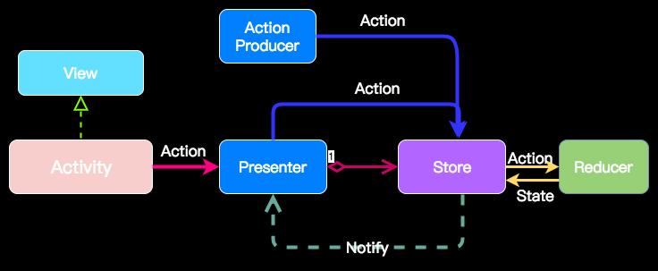
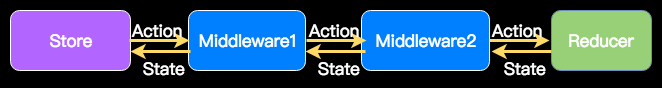

# Rodux

### Redux implementation in Java

[](https://jitpack.io/#yangweigbh/AndroidRedux)

## Setup:

add it in your root `build.gradle`

```java

allprojects {
    repositories {
        ...
        maven { url 'https://jitpack.io' }
    }
}
```
in your app `build.gradle`

```java

dependencies {
    compile 'com.github.yangweigbh:AndroidRedux:0.1'
}

```

## Usage



One Store per Activity， MVP architecture is recommended

Define your Action, State and Reducer for Store

Action:

```java
public interface ColorAction {
    class ChangeColorAction implements ColorAction {
    }

    class ColorSuccessAction implements ColorAction {
        int color;

        public ColorSuccessAction(int color) {
            this.color = color;
        }
    }

    class ColorFailAction implements ColorAction {
        String errorMessage;

        public ColorFailAction(String errorMessage) {
            this.errorMessage = errorMessage;
        }
    }
}
```

State:

```java
public class ColorState {
  public static final int INVALID_COLOR = -1;

  public final int color;
  public final String error;
  public final boolean isRefreshing;

  public ColorState(int color, String error, boolean isRefreshing) {
    this.color = color;
    this.error = error;
    this.isRefreshing = isRefreshing;
  }
}
```
Reducer

```java
public class ColorReducer implements Reducer<ColorAction, ColorState> {

    @Override
    public ColorState reduce(ColorAction action, ColorState currentState) {
        if (action instanceof ColorAction.ChangeColorAction) {
            return ColorState.refreshing();
        } else if (action instanceof ColorAction.ColorSuccessAction) {
            return ColorState.success(((ColorAction.ColorSuccessAction) action).color);
        } else if (action instanceof ColorAction.ColorFailAction) {
            return ColorState.error(((ColorAction.ColorFailAction) action).errorMessage);
        }

        return currentState;
    }
}
```

In your `Activity`, create `Store` and `Presenter`, set the inital state of `Store`

```java
public class ColorActivity extends AppCompatActivity implements ColorContract.View {

    private ColorPresenter mPresenter;

    @Override
    protected void onCreate(Bundle savedInstanceState) {
        super.onCreate(savedInstanceState);
        setContentView(R.layout.activity_main);
        .....
        Store<ColorAction, ColorState> store = new Store<>(Executors.newFixedThreadPool(1),
                ColorState.empty(), new ColorReducer(), Arrays.asList(logMiddleware, colorMiddleware));
        mPresenter = new ColorPresenter(store, this, new MainThreadExecutor());
    }
```

`Presenter` translate view interaction into action and notify `Store`

```java
public class ColorPresenter extends BasePresenter<ColorAction, ColorState> implements ColorContract.Presenter {

    @Override
    public void changeColor() {
        mStore.dispatch(new ColorAction.ChangeColorAction());
    }
}
```

`Store` use `Reducer` to reduce new state

```java
mReducer.reduce(action, currentState);
```

and notify new state back to `Presenter`

```java
private void dispatchState(S state) {
    for (StateHandler<S> stateHandler: mStateHanlders) {
        stateHandler.onNext(state);
    }
}
```

`Presenter` notify `View` to render state

```java
public void handleState(ColorState next) {
    mView.render(next);
}
```

### Async Action

if some async fetch should be triggered by action, you can define your own middleware which can intercept the action before the action dispatch to reducer



```java
public class ColorMiddleware implements Middleware<ColorAction,ColorState> {
    public static final int MAX_COLOR = 256;

    private Random mRandom = new Random();
    private Executor mExecutor = Executors.newFixedThreadPool(1);

    public ColorMiddleware() {
    }

    @Override
    public void intercept(Chain<ColorAction, ColorState> chain) {
        if (chain.getAction() instanceof ColorAction.ChangeColorAction) {
            Runnable runnable = () -> {
                //simulate network request
                try {
                    Thread.sleep(2000);
                } catch (InterruptedException e) {
                    e.printStackTrace();
                }

                int rand = mRandom.nextInt(2);
                if (rand == 0) {
                    final int rgb =
                            Color.rgb(mRandom.nextInt(MAX_COLOR), mRandom.nextInt(MAX_COLOR), mRandom.nextInt(MAX_COLOR));
                    chain.getStore().dispatch(new ColorAction.ColorSuccessAction(rgb));
                } else if (rand == 1) {
                    chain.getStore().dispatch(new ColorAction.ColorFailAction("Network Error"));
                }
            };

            mExecutor.execute(runnable);
        }

        chain.proceed(chain.getAction());
    }
}

```

you can refer to demo for more detail


### Advantage of Unidirectional State flow

Easier management of view state, easier debugging

you can log the state and action, and upload to server.

once you have the state and action before the crash, you set it to the initial state of store,  and trigger the action, the crash can be reproduced.

```
11-18 12:20:58.816 D/LoggerImpl: action: ChangeColorAction{}
11-18 12:20:58.841 D/LoggerImpl: state: ColorState{color=-1, error='null', isRefreshing=true}
11-18 12:21:00.844 D/LoggerImpl: action: ColorSuccessAction{color=-686133}
11-18 12:21:00.844 D/LoggerImpl: state: ColorState{color=-686133, error='null', isRefreshing=false}
11-18 12:21:03.824 D/LoggerImpl: action: ChangeColorAction{}
11-18 12:21:03.824 D/LoggerImpl: state: ColorState{color=-1, error='null', isRefreshing=true}
11-18 12:21:05.826 D/LoggerImpl: action: ColorSuccessAction{color=-11877933}
11-18 12:21:05.826 D/LoggerImpl: state: ColorState{color=-11877933, error='null', isRefreshing=false}
```
